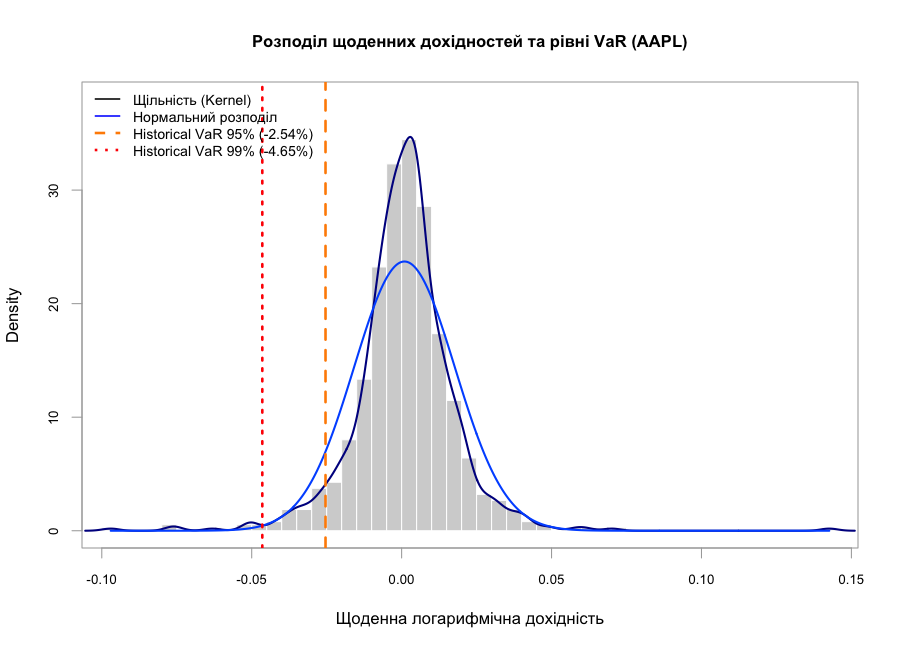

# Оцінка ринкового ризику (VaR та ES)

Репозиторій містить аналітичний R-скрипт та розрахунки метрик ризику для акцій **Apple Inc. (AAPL)** та індексу **S&P 500 (^GSPC)** за останні 3 роки.

## Результати розрахунків метрик ризику

| Метрика ризику | AAPL (Акції) | S&P 500 (Індекс) | Опис та інтерпретація |
| :--- | :---: | :---: | :--- |
| **Historical VaR (95%)** | **-2.54%** | **-1.25%** | Максимальний щоденний збиток у 95% торгових днів |
| **Historical VaR (99%)** | **-4.65%** | **-2.18%** | Стресовий поріг втрат на горизонті 1% найгірших днів |
| **Parametric VaR (95%)** | **-2.42%** | **-1.21%** | Поріг ризику за припущення нормального розподілу |
| **Parametric VaR (99%)** | **-3.48%** | **-1.74%** | Нормальний VaR занижує ризик |
| **Expected Shortfall (95%)** | **-3.71%** | **-1.89%** | Середній розмір збитків при перевищенні порогу VaR 95% |

## Графік розподілу дохідностей та рівнів VaR

## Структура репозиторію
* `scripts/main_analysis.R` — аналітичний розрахунковий скрипт у мові R.
* `data/var_chart.png` — згенерований графік гістограми з нанесеними рівнями ризику.
